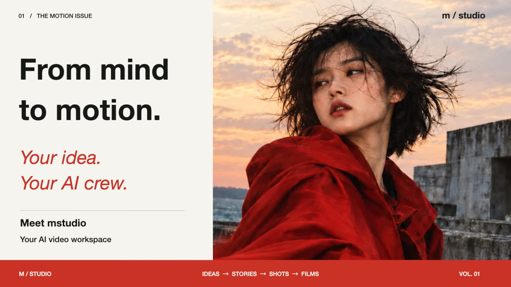
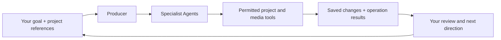

# Mstudio

**A Vibe Video Studio · From mind to motion.**

**English** | [简体中文](README.zh-CN.md)

An Agent-powered desktop video studio. Describe what you want to make, and work with a team of AI specialists that can write scripts, design shots, prepare and generate media, and make edits directly in your project. You can inspect the results and take over in the script, canvas or timeline at any point.

We call this **Vibe Video**: direct the work through conversation, see the changes in your project, and refine the result together. Bring your own models, configure the creative team, and keep the work on your computer.

[Product video](#product-video) · [How Agents work](#how-agents-work) · [Quick start](#quick-start) · [Features](#features) · [Development](#development) · [Contributing](CONTRIBUTING.md) · [Report a bug](https://github.com/Yaozy-C/mstudio/issues)


*Actual desktop interface. A script is attached to an example revision request; the request is an unsent draft, not a completed Agent run.*

> **Platform support.** The macOS bundle targets Apple Silicon and macOS 26.0 or later. The repository includes a Windows 10/11 x64 installer workflow; physical device validation is still required. Linux native desktop preview is not supported. See the [development guide](docs/development.md) for build instructions and platform details, and [LICENSE](LICENSE) for usage terms.

## Product video

[](https://github.com/Yaozy-C/mstudio/releases/download/product-videos-2026-10/mstudio-product-intro-en.mp4)

**[English video · MP4](https://github.com/Yaozy-C/mstudio/releases/download/product-videos-2026-10/mstudio-product-intro-en.mp4)** · [中文版](README.zh-CN.md#产品宣传视频)

56 seconds · 1080p · 60 fps. Click the cover to open or download the video. A private-beta introduction to the Agent team, editing, captions, color and transitions, combining actual interface captures with labeled animated demonstrations. Some brand visuals are AI-generated.

## How Agents work

Give the **Producer** a goal, or address a specialist directly with `$`. Use `@` to attach the script, shot, media item or timeline clip you want to work on. Agents can read that project context and use their permitted tools to save changes back into the same project.



The Producer coordinates scope and dependencies and delegates specialist work as needed. This is a configurable team, not a mandatory sequence through every role. A script-only task can stop with a saved script; a targeted color request can go straight to the Colorist.

### A creative team with distinct responsibilities

| Agent | Work it can do in the project |
| --- | --- |
| **Producer** | Maintain the brief and constraints, delegate to enabled specialists and follow up on actual results. |
| **Writer** | Create and revise structured scripts: action, dialogue, on-screen text, sound and paragraph timing. |
| **Shot director** | Turn the script into shot designs with framing, action, camera movement and references. |
| **Asset Agent & Storyboard artist** | Prepare missing visual references and produce or revise storyboard images using configured image models. |
| **Media producer** | Prepare generation prompts and references, submit authorized media jobs and track their results. |
| **Editing and sound** | Select existing media, arrange clips and captions, and adjust timing and sound on the timeline. |
| **Colorist & Transition designer** | Inspect the relevant frames and parameters, then apply supported color or transition edits to selected clips. |

An optional **Reviewer** can inspect outputs without editing them. It is disabled in the shipped defaults; enable it when you want that role. Available actions always depend on the role's effective tool permissions and the configured models.

### Ask for a change, then inspect the result

These are example requests, not recorded execution results:

| Your direction | The project work it asks for |
| --- | --- |
| “Write a 15-second launch film using these references. Save the script; leave media generation for later.” | The Producer can delegate to the Writer, which saves editable script paragraphs. |
| “Break this script into shots. Keep the final reveal and the existing dialogue.” | The Shot director can save linked shot designs while preserving the specified content. |
| “Generate an image for shot 2 using this product reference.” | A specialist with image-generation permission can prepare and submit a job through your configured service. |
| “Trim the opening clip to three seconds. Leave the other clips and captions unchanged.” | The editing specialist can update the selected timeline clip through project tools. |
| “Make this clip cooler while preserving the product color.” | The Colorist can inspect frames, change supported parameters and recheck the resulting pixels. |

**The output is editable project work.** Script and shot tools save structured content; timeline tools modify clips; generation tools return job and result state. Operation details appear in the conversation so you can inspect what ran. A saved edit or completed generation job does not by itself establish visual quality—review the actual media before accepting it.

### Configure how your Agents work

- **Roles and instructions:** edit each Agent's responsibilities or create your own roles.
- **Skills:** assign reusable creative methods and guidance to the roles that need them.
- **Tool permissions:** separately control access to scripts, shots, media generation, timeline edits, delegation and project memory. Assigning a Skill does not grant tool access.
- **Project memory:** keep goals, constraints and confirmed decisions available across the project when memory is enabled.
- **Models:** choose chat and media models independently. What an Agent can see or generate depends on those models' capabilities.

## Features

- **Script to shots.** Write visuals, dialogue, on-screen text and sound as separate fields. Set paragraph timing and keep shots linked to their source script.
- **A canvas for production.** Arrange references and media, inspect storyboard frames, and keep alternatives together before deciding what belongs in the film.
- **Your models, your workflow.** Configure chat and media models separately. Generate and revise images or videos with the references and controls supported by each provider.
- **Specialist Agents.** Configure a producer, writer, shot director, storyboard artist, editor and other roles with editable instructions, Skills and tool permissions. Reference specific project items in conversation.
- **An editable timeline.** Arrange multiple tracks; split, trim and retime clips; detach audio; adjust color and transitions; add captions and local voiceover; preview and export MP4.
- **Local project storage.** Automatic saving, project memory, a reusable media library and storage migration. The interface supports English and Simplified Chinese.

Manual media import, editing and local export do not require an AI account.

### Review and edit the result yourself


*The Daybreak project uses original demo artwork. These captures demonstrate the interface, not AI-generated output.*

### Write the story and its sound


### Keep references and media in view


## Quick start

### Build and run on macOS

Use an Apple Silicon Mac running macOS 26.0 or later for the bundled build. Install Xcode Command Line Tools, [Rust via rustup](https://rustup.rs/), [Bun](https://bun.sh/) and [Homebrew](https://brew.sh/). The repository pins its Rust version in [`rust-toolchain.toml`](rust-toolchain.toml). Python 3.12 or newer is required. Source access and use are subject to [LICENSE](LICENSE).

```sh
git clone https://github.com/Yaozy-C/mstudio.git
cd mstudio

brew install python pkgconf ffmpeg gstreamer
(cd frontend && bun install --frozen-lockfile)
python3 scripts/bundle-ges.py
sh scripts/dev.sh
```

The development script starts the frontend and the Tauri desktop application. Use the desktop application for file imports, native playback, generation and export; the browser preview alone does not provide the complete workflow.

To build a local app bundle:

```sh
sh scripts/bundle.sh
open Mstudio.app
```

This creates `Mstudio.app` in the repository root. See the [development guide](docs/development.md) for native dependencies, media regression checks and platform limitations.

### Make your first film

1. Open **General → Language** to choose English or 简体中文.
2. Create a project. Import your own media, or start by writing a script.
3. For AI assistance, open **Models**, add a service connection and configure a chat model. Add image or video models when you need generation.
4. In chat, use `@` to reference project items and `$` to choose a specialist. For example: “Help me outline a 15-second landscape film. Keep the pace quiet and leave room for natural sound.”
5. Arrange and inspect media in **Production canvas**, then edit in **Film**. Review picture and sound before exporting.

Remote AI services require your own account or API key and may charge for usage. Model inputs, generation controls and availability depend on the configured provider.

## Agent runtime and model connections

Chat connections support OpenAI-compatible APIs, Responses, Gemini and native Claude protocols, including compatible local services. Media generation uses separate adapters and model configuration; support for a chat protocol does not automatically imply image or video generation support.

The Rust harness runs model/tool turns behind a host interface, checks tool permissions, records operation results and supports task recovery. Delegation distinguishes a fresh context (`spawn`), a new child seeded from completed parent history (`fork`), and follow-up messages to an existing `continuable` child. One-shot children cannot be resumed. Current specialist delegation is bounded and non-recursive.

For implementation details, see the [default role definitions](frontend/src/agents/defaults.json), [delegation interface](desktop/src/assistant/harness/delegation.rs) and [architecture guide](docs/architecture.md).

## Data and privacy

- Projects and media are stored locally. On macOS, the default application data directory is `~/Library/Application Support/local.mstudio.canvas/`; media may be stored elsewhere if you move it in **General → Storage**.
- Online model requests send prompts and selected references to the configured provider. Local storage does not mean all AI processing happens on your computer.
- API credentials currently reside in the local SQLite database and are **not protected by the system keychain**. Do not share your database, full application data directory or credential-bearing logs.
- Autosave is not versioned backup. Quit the app before backing up its application data and any separately configured media directory.

Report vulnerabilities privately using the instructions in [SECURITY.md](SECURITY.md).

## Current limitations

- AI output needs human review for visual consistency, motion, timing and sound.
- Transitions currently target adjacent, opaque, full-frame base-layer visuals. They do not provide optical flow, occlusion masks or audio crossfades.
- Color controls are not a complete professional color-management workflow.
- Native playback, file dialogs and real model integrations still require desktop validation. Passing automated checks is not a substitute for watching the finished film.

## Development

Mstudio uses **React + TypeScript** for the interface, **Tauri + Rust** for desktop services, **SQLite** for persistence, **GStreamer Editing Services (GES)** for native preview and **FFmpeg** for media processing and export.

```text
frontend/       React interface, canvas, timeline and Agent configuration
desktop/        Tauri host, persistence, Agent runtime and model adapters
src/            Shared Rust editing and media logic
skills/         Bundled creative methods and role guidance
scripts/        Development, validation and macOS packaging
```

Run the required checks after preparing the native dependencies:

```sh
sh scripts/check.sh
```

This checks formatting, source release hygiene, source size, Skills, frontend build and tests, and Rust linting and tests. Some backend tests start a local HTTP server and need loopback access. No external model account is required for the check suite.

## Contributing

Bug reports, documentation, translations and focused fixes are welcome. Read [CONTRIBUTING.md](CONTRIBUTING.md) before opening a pull request. Include your OS version, reproduction steps and sanitized diagnostics in bug reports. Discuss larger changes in an issue first.

Start with the [development guide](docs/development.md) and [architecture guide](docs/architecture.md); these detailed guides are currently in Chinese. The repository homepage and contribution/security guidance are available in English.

## License

New project-owned changes after commit `f729b0d` are proprietary; see [LICENSE](LICENSE). Commercial releases require a separate license. Previously published MIT code retains its original rights; see [LICENSE-MIT-LEGACY](LICENSE-MIT-LEGACY). Third-party libraries and brand assets retain their own licenses; see [THIRD_PARTY_NOTICES.md](THIRD_PARTY_NOTICES.md). Packaging the application does not replace the redistribution obligations of FFmpeg, GStreamer or their dependencies.
