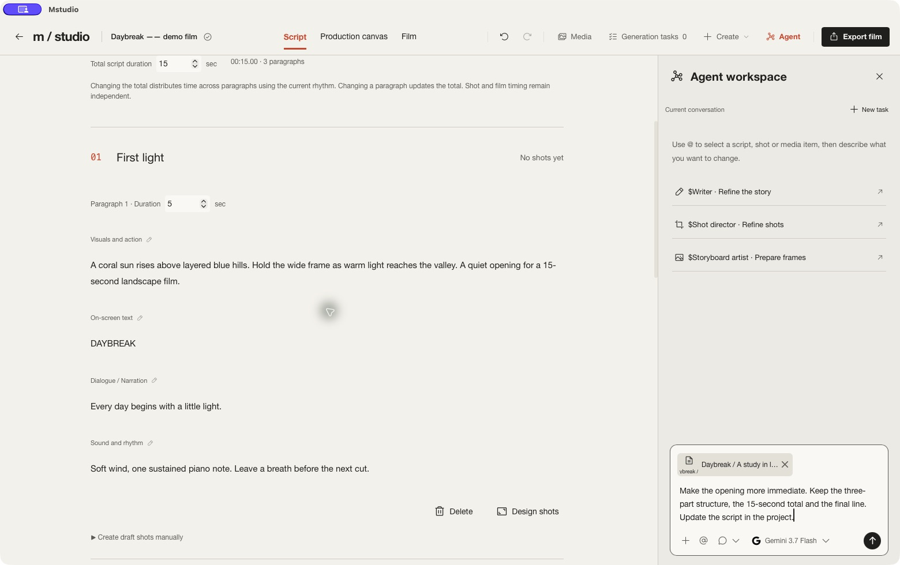
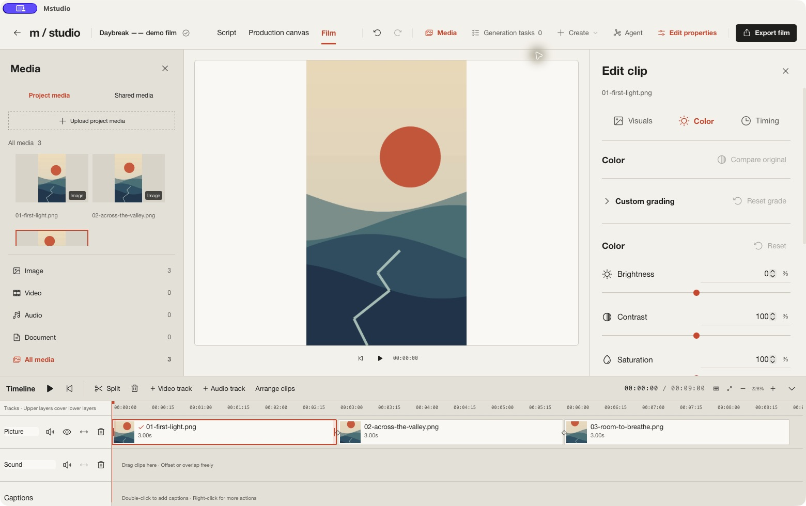
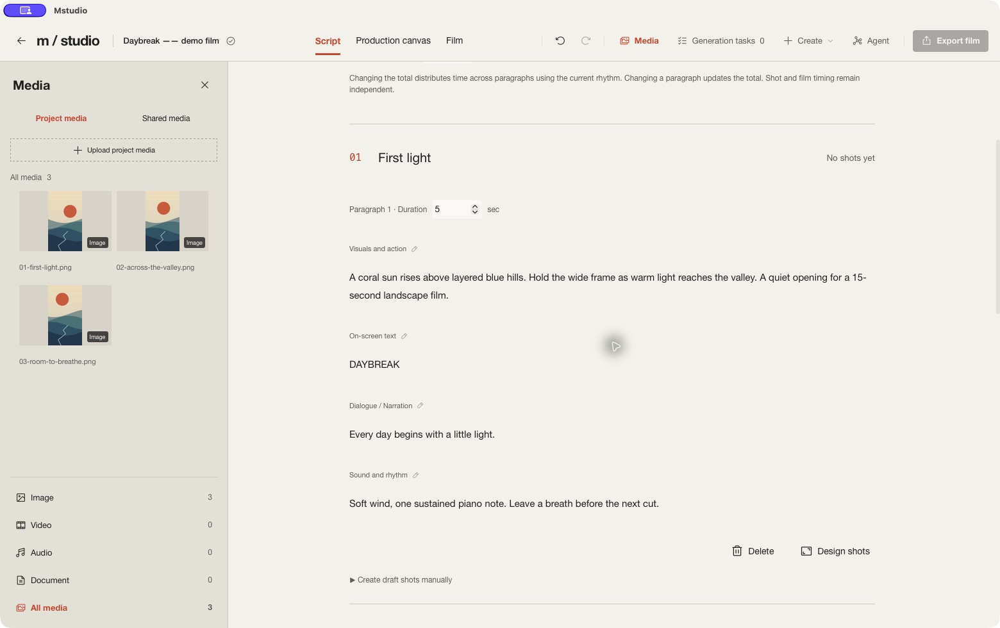
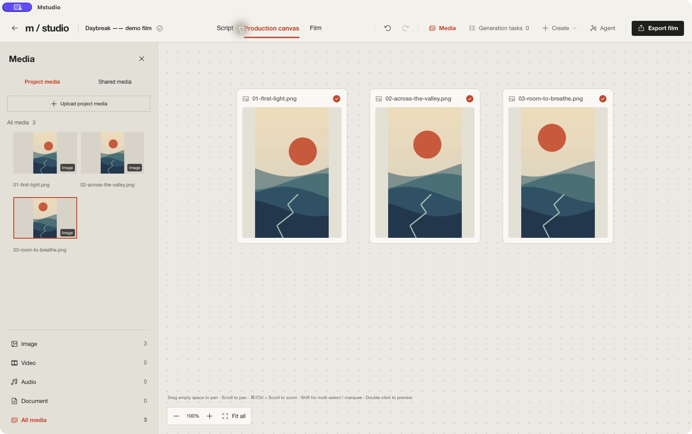

# mstudio

**A Vibe Video Studio · From mind to motion.**
从脑海里的画面，到自己的影片。

[English](README.md) | **简体中文**

mstudio 是一个由 Agent 参与创作和操作的桌面视频工作室。你描述目标，AI 专业团队可以在项目里写脚本、设计镜头、准备与生成素材、修改剪辑。你随时能在脚本、画布和时间线里检查结果、直接接手。

脑海里的画面往往很难一次描述清楚。看过分镜，才知道构图该怎么改；播放片段，才发现动作太慢、音乐进早了。我们把这种边聊、边看、边调整的创作方式叫作 **Vibe Video**。画布把方案和素材摊开，时间线让你调整具体片段，创作助手参与写作和操作，你随时可以接手。

> **平台支持**：macOS 应用包面向 Apple Silicon、macOS 26.0 及以上版本。仓库提供 Windows 10/11 x64 安装包构建流程，仍需实机体验验证；Linux 暂不支持桌面原生预览。构建说明见[开发指南](docs/development.md)，使用条款见[许可声明](LICENSE)。

## 产品宣传视频

**[中文视频 · MP4](https://github.com/Yaozy-C/mstudio/releases/download/product-videos-2026-10/mstudio-product-intro-zh-CN.mp4)** · [English version](README.md#product-video)

56 秒 · 1080p · 60 帧。点击封面打开或下载视频。这支内测宣传片展示多 Agent、剪辑、字幕、调色与转场，包含真实界面和已标注的动画示意；部分品牌画面使用 AI 生成素材。

## Agent 怎样参与创作

把目标交给**项目统筹**，或用 `$` 直接选择专业角色；用 `@` 引用要处理的脚本、镜头、素材或时间线片段。Agent 读取项目上下文后，通过被授权的工具把修改保存回同一个项目。

*真实英文桌面界面。图中是尚未发送的示例请求，不是已完成的 Agent 执行记录。*

流程是：**你的目标与引用 → 统筹按需委派 → 专业角色调用工具 → 项目修改与操作结果 → 你检查并继续提出方向**。不要求每个任务都走完全部角色；只写脚本可以停在脚本，调色任务也可以直接交给调色师。

| 角色 | 在项目中能做什么 |
| --- | --- |
| **项目统筹** | 维护目标与约束，安排已启用的专业角色，跟进实际结果。 |
| **创意编剧** | 写入和修订包含动作、台词、画面文字、声音和段落时长的结构化脚本。 |
| **分镜导演** | 将脚本拆成关联镜头，设计构图、动作、机位、运镜与引用。 |
| **资产 Agent、分镜画手** | 补齐缺失的视觉参考，通过已配置图片模型制作和修改分镜图。 |
| **媒体制作** | 准备生成提示词与参考，提交已授权的媒体任务，跟踪结果。 |
| **剪辑声音** | 选用已有素材，编排片段和字幕，调整时间线时序与声音。 |
| **调色师、转场设计** | 检查相关画面和参数，对指定片段应用工具支持的调色或转场。 |

审片角色可以独立检查而不修改项目，出厂配置默认关闭，可按需启用。实际可用能力取决于角色的工具权限与模型配置。

你可以这样提出任务（以下为用法示例，不是执行记录）：

- “用这些参考写一支 15 秒短片，保存脚本，先不要生成素材。”
- “把这份脚本拆成镜头，保留结尾揭晓和已有台词。”
- “用这张产品参考生成镜头 2 的分镜图。”
- “把开头片段裁到三秒，其他片段和字幕不动。”
- “这个片段整体冷一点，但保留商品本来的颜色。”

**Agent 的产物是可编辑的项目内容。** 脚本和镜头工具保存结构化内容，剪辑工具修改片段，生成工具返回任务和结果状态；对话中可以展开查看操作详情。保存成功或生成完成不等于画面已经合格，仍需检查实际素材。

在 Agents 设置里可以编辑职责与指令、创建角色、装配 Skills，并单独设置工具权限。**Skill 提供方法，工具权限决定能做什么**。项目记忆启用后可保存目标、约束和已确认决定；对话与媒体模型分别配置，其输入和生成能力决定 Agent 能看到、生成什么。

## 界面预览

以下为 macOS 桌面应用的真实英文界面，使用为文档制作的原创演示素材。

查看脚本与制作画布

## 你可以用它做什么

1. **带着参考开始创作**
   导入图片、视频、音频、文字资料和 PDF。把素材放到画布里整理，或在对话里引用具体内容，让 AI 围绕你的材料工作。项目素材用于当前影片，全局素材库方便多个项目重复使用。模型能否理解某种资料，取决于它支持的输入类型。

2. **写清楚故事，也写清楚声音**
   在脚本工作区分别编辑画面与动作、台词与旁白、画面文字、声音与节奏，以及预计时长。可以让创意编剧起草，也可以自己写。修改总时长时，时间会按现有节奏分配到各段；你也能单独调整某一段。

3. **先设计镜头，再看见分镜**
   分镜导演根据完整脚本设计景别、机位、主体动作、相机运动和切点。分镜画手把设计变成可见的画格；复杂动作可以用同一镜头的多个关键画格表达。脚本段落和镜头保持关联，方便回到具体位置继续修改。

4. **围绕每个镜头生成和修改素材**
   镜头保留生成描述、参考和结果。按模型能力使用内容参考、动作参考或首尾帧；也能选中图片，直接告诉 AI 想怎么改。生成任务显示进度，结果可预览、引用和放到画布，挑选满意的版本再加入时间线。遇到异常时，可以查询原任务或重试收取已有结果。

5. **把节奏剪到你满意**
   在多轨时间线上安排画面和声音，移动、分割、裁剪、变速、复制或删除片段，调整画面大小、位置、不透明度和音量。可以分离视频中的音频，设置声音淡入淡出，逐帧检查切点。引用具体片段给 Agent，它也可以协助修改。

6. **补上字幕、配音、转场和色彩**
   手动添加字幕，导入或导出 SRT，调整字体、颜色和位置。使用本机已安装的声音生成分段配音，并按实际配音长度创建字幕。相邻的底层画面片段可添加叠化、推移、擦除等转场；调色支持亮度、对比度、饱和度和冷暖调整，也可以请转场 Agent 或调色师协助。

7. **配置自己的创作团队和模型**
   项目统筹、创意编剧、分镜导演、分镜画手、媒体制作、剪辑声音、审片等 Agent 按职责参与制作。你可以编辑职责和工作指令，装配 Skills 中的创作方法，并单独设置工具权限。对话与媒体生成分别选择模型，可以连接兼容的本地或在线服务。

8. **继续上次的创作，导出自己的影片**
   项目自动保存到本机。项目记忆保存目标、约束和已经确定的事，供同一项目的 Agent 使用。完成后在本机导出 MP4，预览成片并另存到需要的位置。设置中心支持简体中文和 English，也可以更改素材存储目录并迁移已有文件。

## 从第一个项目开始

### 1. 打开应用，选好语言和模型

在项目首页打开 **通用设置 → 语言**，选择简体中文或 English，立即生效，下次打开仍会保留。语言设置只改变界面，不翻译你已经写好的脚本、提示词、项目名称或聊天记录。

在 **模型 → 服务连接** 添加要使用的服务，再添加对话模型，并设为默认。图像、视频和音频模型分别管理，按你的创作需要配置。支持的接入方式包括兼容 OpenAI 的服务、Responses、Gemini、Claude 原生接口，以及支持相应协议的本机服务。

使用远程服务时，需要你自己的账号或 API Key，费用由相应服务商收取。仅导入素材、手动剪辑和本地导出，不需要配置 AI 模型。

### 2. 新建项目，把目标和参考放进来

点击 **新建项目**，给影片起一个名字。新项目默认是 1080 × 1920 竖屏。

打开 **素材** 导入文件。你可以直接把已有素材加入时间线，也可以先放到制作画布上构思。聊天中输入 `@` 引用素材、脚本或镜头，输入 `$` 选择专业 Agent。

例如，你可以告诉项目统筹：

> 我想做一支 30 秒的咖啡店短片，给附近上班的人看。希望安静、有生活感。这几张图是店内环境，先帮我整理方向和脚本。

### 3. 写脚本，检查镜头设计

进入 **脚本**，让 AI 起草或手动编写。先看故事是否说清楚，台词、画面文字和声音是否合适，再选择 **设计整片镜头**。到 **制作画布** 查看镜头和分镜画格，引用需要调整的部分继续讨论。

> 这个镜头先让观众看清杯口的热气，再切到人物。不要改后面的台词。

### 4. 制作画面，选出可用的结果

为镜头选择图像或视频模型，填写生成描述，放入参考，按模型能力设置画幅、时长或首尾帧。检查后开始生成。结果回来后先预览，再决定修改、重新生成，还是加入时间线。

如果提交结果不明确，先查询原任务或到服务商核查，避免重复生成和重复计费。

### 5. 剪辑、试听、导出

进入 **成片**，在时间线上调整顺序、切点和声音，按需要添加字幕、配音、转场和调色。播放完整影片，检查画面与声音是否符合预期，然后点击 **导出成片 → 开始导出**。完成后可以预览，并 **另存为 MP4**。

## 常用操作

| 想做什么 | 如何操作 |
| --- | --- |
| 让 AI 针对具体内容修改 | 对话中输入 `@`，或使用素材、镜头、片段的「引用到对话」 |
| 选择专业助手 | 对话中输入 `$` 选择 Agent |
| 查看素材或生成结果 | 双击画布内容，或使用预览操作 |
| 将素材用于成片 | 拖入时间线，或选择「加入时间线」 |
| 分割选中片段 | `⌘B`，Windows 使用 `Ctrl+B` |
| 复制 / 剪切 / 粘贴片段 | `⌘C` / `⌘X` / `⌘V`，Windows 使用 `Ctrl` |
| 裁掉播放头前 / 后的内容 | `⌥[` / `⌥]`，Windows 使用 `Alt` |
| 撤销 / 重做 | `⌘Z` / `⇧⌘Z`，Windows 使用 `Ctrl` |
| 播放 / 暂停 | `Space`；更多操作见时间线「快捷键」 |

裁剪保留片段速度；剪切和删除留下空隙，不会自动移动其他片段。文字输入框内仍使用文字编辑快捷键。

## 保存、素材和隐私

- **自动保存**：停止操作约 1.5 秒后保存到本机；可通过工作栏的保存状态确认。自动保存不等于历史版本备份。
- **项目记忆**：在当前项目的设置中维护目标和关键决定，可以手动添加，也可以允许 Agent 整理。切换模型或清空聊天不会清掉项目记忆。
- **素材存储**：在 **通用设置 → 存储** 查看位置、选择新目录并迁移。文件缺失时保留镜头、时间线位置和引用；文件放回原位置后自动恢复。
- **备份**：macOS 默认应用数据位于 `~/Library/Application Support/local.mstudio.canvas/`。先退出应用，再备份整个目录；如果迁移过素材目录，也要备份设置中显示的素材文件夹。
- **远程模型**：本地工作室不代表所有 AI 都在本机运行。调用在线模型时，提示词和所选参考会发送给对应服务商。
- **账号凭据**：当前保存在本机数据库中，尚未使用系统钥匙串加密存储。不要公开数据库、完整数据目录或含密钥的日志。

## 当前边界

AI 生成仍可能出现物体错误、动作不自然和前后不一致，需要人工选择和调整。导入参考并不意味着应用会自动搜索或筛选参考视频。

转场目前适用于全幅、不透明的底层相邻画面片段，时长为 0.05–3 秒且不超过相邻片段；素材余量不足时延展边缘帧。当前不包含自动光流、蒙版遮挡和音频交叉淡化。调色提供基础调整，尚不属于完整的专业色彩管理系统。

浏览器开发页面用于界面预览。文件导入、原生播放、生成任务和导出等完整流程需要桌面应用；浏览器中的转场预览显示直接切换。

## 获取与参与

目前可以从源码构建并运行桌面应用。安装依赖、启动与打包步骤见 [开发指南](docs/development.md)。开发实现另见 [架构说明](docs/architecture.md)。

欢迎通过 [贡献指南](CONTRIBUTING.md) 参与。报告问题时，请提供系统版本、复现步骤和脱敏后的错误信息；安全问题请参见 [安全说明](SECURITY.md)。

从提交 `f729b0d` 之后首次发布的项目自有新增修改采用[专有许可声明](LICENSE)，商业版本按另行提供的许可协议使用。历史 MIT 代码的授权继续有效，见 [历史 MIT 许可](LICENSE-MIT-LEGACY)。第三方依赖和品牌图标见 [第三方声明](THIRD_PARTY_NOTICES.md)。
